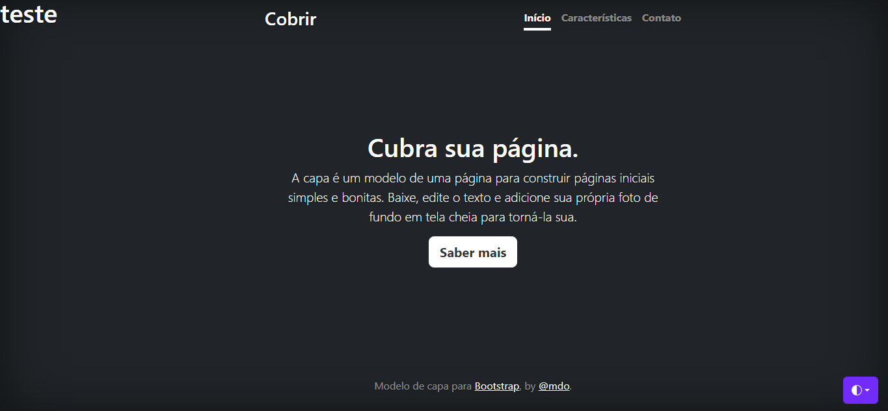

------
# Índice

* [Projeto - Portifólio para escrita do README](#projeto---portif%C3%B3lio-para-escrita-do-readme)
* [Descrição](#descri%C3%A7%C3%A3o)
* [Funcionalidades](#funcionalidade)
* [Tecnologias utilizadas](#tecnologias-utilizadas)
* [Fontes consultadas](#fontes-consultadas)
* [Autores](#autores)

# Projeto - Portifólio para escrita do README
 
[MENU DE NAVEGAÇÃO](#%C3%ADndice)

## Descrição
Este é um modelo de página inicial simples e bonita, projetado para ajudar você a criar uma presença online atraente rapidamente. Com um design limpo e moderno, esta página proporcionará uma experiência agradável aos visitantes. 
[MENU DE NAVEGAÇÃO](#%C3%ADndice)

## Funcionalidade
Uma página com contato, home, caracteristicas. 
[MENU DE NAVEGAÇÃO](#%C3%ADndice)

### Tecnologias utilizadas
1. `Git`
2. `Git Hub`
3. `Visual Estudio Code`
4. `Html`, `Css`, `Bootstrap` 
[MENU DE NAVEGAÇÃO](#%C3%ADndice)

## Fontes consultadas
1. `Bootstrap`
2. `Alura`
3. `Git Hub` 
[MENU DE NAVEGAÇÃO](#%C3%ADndice)

## Autores
* [`CaioTico`](https://github.com/caiotico) 
[MENU DE NAVEGAÇÃO](#%C3%ADndice)
------
